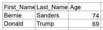

<!-- START doctoc generated TOC please keep comment here to allow auto update -->
<!-- DON'T EDIT THIS SECTION, INSTEAD RE-RUN doctoc TO UPDATE -->


- [Tabula: flip the table](#tabula-flip-the-table)
  - [Getting started](#getting-started)
  - [A quick tour of the premises](#a-quick-tour-of-the-premises)
  - [Make some tweaks](#make-some-tweaks)
    - [Naming the columns](#naming-the-columns)
      - [Column name inference](#column-name-inference)
      - [Manual column naming](#manual-column-naming)
    - [Other output formats](#other-output-formats)
      - [CSV output (in `tabula-core`)](#csv-output-in-tabula-core)
      - [JSON output (in `tabula-json`)](#json-output-in-tabula-json)
      - [Excel output (in `tabula-excel`)](#excel-output-in-tabula-excel)
  - [Extending Tabula](#extending-tabula)
    - [Support for additional data types](#support-for-additional-data-types)
    - [New output formats](#new-output-formats)
    - [A total conversion](#a-total-conversion)
  - [License](#license)

<!-- END doctoc generated TOC please keep comment here to allow auto update -->

# Tabula: flip the table

Tabula is a small Scala library that provides structures and tooling that can
help output data from Scala code in a tabular format.

What's a "tabular format"? They're everywhere, though I'm glad you asked! Web
applications (especially in the financial domain) show lots of tables full of
numbers and provide data extracts in the form of CSV & Excel files.
Command-line tools often provide output in the form of tables. During
development it's sometimes helpful to dump out a bunch of data points as a
table right inside a REPL session.

This project aims to accomplish the following goals in a (hopefully) elegant
and safe way:

* Introduce a "row of data cells" abstraction that goes beyond the tired and
  dangerous `List[String]` of yore.
* Provide tools for organizing column definitions into tables.
* Safeguard correctness of output by statically verifying that only suitable
  data is fed into the table.
* Make it so you never have to match up column headings to data again.
* Provide standardized output mechanisms for printing to the console, writing
  out a CSV file, exporting to Excel, and exposing JSON output.

## Getting started

Due to its experimental nature, Tabula isn't currently published to
conventional Maven repositories. To use this code, add the following resolver
to your SBT configuration:

```scala
resolvers += "maxaf-releases" at s"https://repo.bumnetworks.com/releases/"
```

Next, ask SBT to include Tabula's dependencies in your project's classpath:

```scala
libraryDependencies += "com.bumnetworks" %% "tabula-core" % "0.1.4"
```

Now it's time to add the imports:

```scala
import tabula._, Tabula._, Column._
import shapeless._
import cats.implicits._
```

## A quick tour of the premises

First we define a row class. Instances of this class will represent rows in our
table. Here we go:

```scala
case class Person(firstName: String, lastName: String, age: Int)
```

Now we can create some column definitions. These are just instances of the
`Column` class, each wrapping a function that knows how to extract column data
from the type that represents a single row:

```scala
object First_Name extends Column((_:Person).firstName)
object Last_Name  extends Column((_:Person).lastName)
object Age        extends Column((_:Person).age)
```

At this point we're able to round up the columns into a single structure that
can be treated as a whole and indivisible table definition:

```scala
object columns extends Columns(First_Name :: Last_Name :: Age :: HNil)
```

We're also going to need some sample data. How about this:

```scala
val dem = Person("Bernie", "Sanders", 74)
val gop = Person("Donald", "Trump", 69)
val persons = dem :: gop :: Nil
```

For the purposes of this example, we're simply going to print to console:

```scala
object console extends Console(minWidth = 7)
columns.write(console)(_.toConsole())(persons.iterator)
```

And here's the output. Tada!

```
+-----------------------------+
|         |         |         |
+-----------------------------+
| Bernie  | Sanders | 74.0    |
| Donald  | Trump   | 69.0    |
+-----------------------------+
```

## Make some tweaks

Tabula's behavior can be customized in a few ways without having to write type
class extensions.

### Naming the columns

By default, columns don't have any names (as you can see above). Tabula sees
the act of defining column shape (i.e. input and output data types) as
fundamentally separate from column naming, which is seen as a presentation
concern. In fact, naming is irrelevant, so columns with and without names are
handled identically except by code that writes output in an external format.
Some such output writers might care about names, while others might not.

There are two ways to name columns.

#### Column name inference

First, you can let Tabula infer names on your behalf. `Column` instances that
mix in the `Namer` trait will have their names inferred without any further
input from you:

```scala
object First_Name extends Column((_:Person).firstName) with Namer
object Last_Name  extends Column((_:Person).lastName)  with Namer
object Age        extends Column((_:Person).age)       with Namer
```

The output will look like this:

```
+----------------------------------+
| First_Name | Last_Name | Age     |
+----------------------------------+
| Bernie     | Sanders   | 74.0    |
| Donald     | Trump     | 69.0    |
+----------------------------------+
```

#### Manual column naming

 Instead of mixing in the `Namer` trait at column definition time, you
set column names when defining a table. Start with bare, unnamed columns:

```scala
object First_Name extends Column((_:Person).firstName)
object Last_Name  extends Column((_:Person).lastName)
object Age        extends Column((_:Person).age)
```

Then name them when defining the table. For this we use the `@@` operator:

```scala
object columns extends Columns(
  First_Name @@ "ze first name" ::
  Last_Name  @@ "ze last name"  ::
  Age        @@ "ze age"        ::
  HNil) // <--- this is a shapeless HList, not a regular Scala List!
```

Now columns are named just like we asked:

```
+----------------------------------------+
| ze first name | ze last name | ze age  |
+----------------------------------------+
| Bernie        | Sanders      | 74.0    |
| Donald        | Trump        | 69.0    |
+----------------------------------------+
```

### Other output formats

Tabula can be extended to support numerous output formats. This happens by type
class. By default Tabula's `tabula-core` module ships only with `Console` and
`CSV` outputs, but there are others as well.

#### CSV output (in `tabula-core`)

CSV support code ships with `tabula-core`, so no additional dependencies are
needed, but we do need to define a formatter for `java.lang.Double` values.
Tabula doesn't assume by default how you might want to format numbers, but does
provide a sensible default in case you want to use it. Let's use it here.

```scala
object csv extends CSV {
  implicit object doubleFormatter extends DefaultDoubleFormatter
}
```

Then we can use the newly created `csv` formatter just like we used `Console`
before:

```scala
columns.write(csv)(_.toConsole())(persons.iterator)
```

Lo and behold:

```csv
"First_Name","Last_Name","Age"
"Bernie","Sanders",74.00
"Donald","Trump",69.00
```

#### JSON output (in `tabula-json`)

Include the JSON module in your project's classpath as follows:

```scala
libraryDependencies += "com.bumnetworks" %% "tabula-json" % "0.1.4"
```

Next, define a JSON formatter. It comes with batteries included, no need to
define anything else:

```scala
import tabula.json._
object json extends JSON
columns.write(json)(_.toConsole())(persons.iterator)
```

And the output will be:

```json
[["First_Name","Last_Name","Age"],["Bernie","Sanders",74.0],["Donald","Trump",69.0]]
```

#### Excel output (in `tabula-excel`)

Include the Excel module in your project's classpath as follows:

```scala
libraryDependencies += "com.bumnetworks" %% "tabula-excel" % "0.1.4"
```

Next, define a Excel formatter. It comes with batteries included, no need to
define anything else:

```scala
import tabula.excel._
object excel extends Excel
```

Excel support is via the Apache POI library. In the spirit of maximum
flexibility (though obviously at a great convenience cost), we have to do a bit
more legwork to write to an XLS file. I'll leave this here without further
comment, as this API will be improved going forward.

```scala
import org.apache.poi.hssf.usermodel.HSSFWorkbook
import java.io.{File, FileOutputStream}
val out = new FileOutputStream(File.createTempFile("ze-candidates.", ".xls"))
Excel(() => new HSSFWorkbook()) {
  ctx =>
  columns.write(excel)(_.toWorkbook(ctx, name = Some("ze candidates")))(persons.iterator)
}.workbook.write(out)
out.flush()
out.close()
```

And the output will be:



## Extending Tabula

Tabula is extremely extensible. Extensions are normally implemented by way of
type classes. Currently three kinds of extensions can be added: support for
additional data types, new output formats, and "total conversion"-style changes
to handling of data types.

### Support for additional data types

### New output formats

### A total conversion

## License

Tabula is available under the terms of the MIT license.
